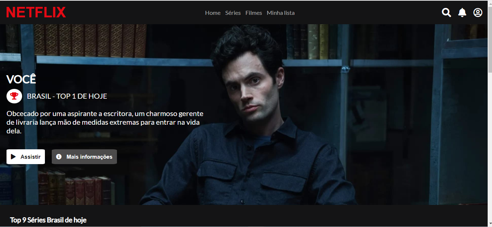

# Clone do site Netflix

# Sobre o projeto
Este repositório foi criado para colocar em prática os conhecimentos adquiridos nos cursos de HTML, CSS e Javascript da <b>Digital Innovation One</b> de um projeto <b>Frontend Web</b>.

O objetivo do projeto foi recriar a interface do site da Netflix utilizando tecnologias simples como <b>HTML5, CSS3 e JavaScript</b>, além de englobar os conceitos de: como estruturar um layout, técnicas de CSS3 com containers e variáveis, como posicionar os elementos com Flexbox e como utilizar plugins JQuery.

# Layout do projeto

# Tecnologias utilizadas

* HTML
* CSS 
* Javascript
* Jquery
* Fontawesome
* Owl Carousel
* Google Fonts 

# Autor
<b>Thallyta Macedo Carvalho de Castro</b>

Linkedin: https://www.linkedin.com/in/thallyta-castro/

Medium: https://medium.com/@thallyta-castro-cv

email: contato@thallytacastro.com.br

